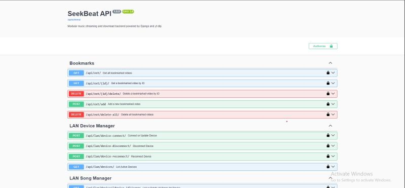
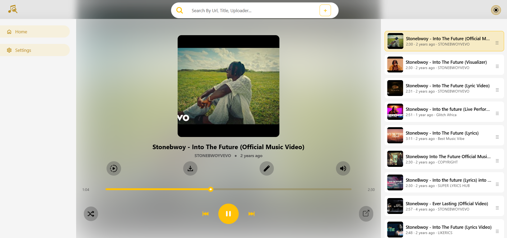
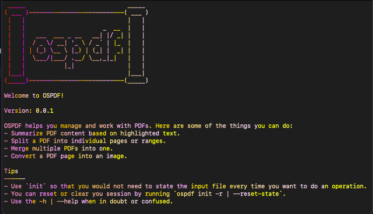
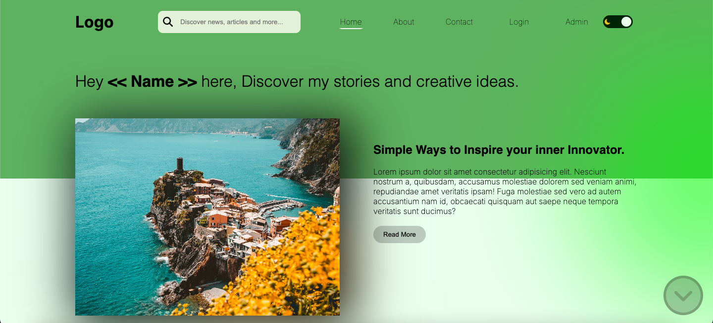

<picture>
  <source srcset="https://raw.githubusercontent.com/Programming-Sai/Programming-Sai/output/github-snake-dark.svg" media="(prefers-color-scheme: dark)" />
  <source srcset="https://raw.githubusercontent.com/Programming-Sai/Programming-Sai/output/github-snake.svg" media="(prefers-color-scheme: light)" />
  
</picture>

 
 

     

<h3 align='center'>Programming-Sai</h3>

Tech-driven, always learning, and focused on building efficient solutions.

  
  
  
  
  

"I am a dedicated Computer Science student with a strong foundation in web and mobile development. My expertise includes working with modern frameworks like React Native, Next.js, and backend technologies such as Node.js and Python. I have hands-on experience building responsive and functional applications, integrating APIs, and implementing authentication systems with OAuth.

I thrive on solving complex problems and would like to contributie to open-source projects. I'm eager to collaborate on innovative and impactful projects that challenge me to grow as a developer."

---

## 🤝 Connect with Me

---

## 📊 GitHub Stats

|                                                                                                                                                                                                                                                                                                                                                                                                                                                                                               |                                                                                                                                                                                                                                                                                                                                                                                                                                                                                                                |
| --------------------------------------------------------------------------------------------------------------------------------------------------------------------------------------------------------------------------------------------------------------------------------------------------------------------------------------------------------------------------------------------------------------------------------------------------------------------------------------------- | -------------------------------------------------------------------------------------------------------------------------------------------------------------------------------------------------------------------------------------------------------------------------------------------------------------------------------------------------------------------------------------------------------------------------------------------------------------------------------------------------------------- |
| <picture><source srcset="https://github-readme-stats.vercel.app/api?username=Programming-Sai&show_icons=true&theme=radical" media="(prefers-color-scheme: dark)" /><source srcset="https://github-readme-stats.vercel.app/api?username=Programming-Sai&show_icons=true&theme=default" media="(prefers-color-scheme: light)" /></picture> | <picture><source srcset="https://github-readme-stats.vercel.app/api/top-langs/?username=Programming-Sai&layout=compact&theme=radical" media="(prefers-color-scheme: dark)" /><source srcset="https://github-readme-stats.vercel.app/api/top-langs/?username=Programming-Sai&layout=compact&theme=default" media="(prefers-color-scheme: light)" /></picture> |

---

### Languages and Tools:

<picture>
  <source srcset="github-dark.svg" media="(prefers-color-scheme: dark)" />
  <source srcset="github-light.svg" media="(prefers-color-scheme: light)" />
  
</picture>
<picture>
  <source srcset="terminal-dark.svg" media="(prefers-color-scheme: dark)" />
  <source srcset="terminal-light.svg" media="(prefers-color-scheme: light)" />
  
</picture>
 
 

---

### Projects Preview

|                                                                                                                                                                                                                                                                                                             |                                                                                                                                                                                                                                                                                                                                                                                                                                                                                                                                  |
| ----------------------------------------------------------------------------------------------------------------------------------------------------------------------------------------------------------------------------------------------------------------------------------------------------------- | -------------------------------------------------------------------------------------------------------------------------------------------------------------------------------------------------------------------------------------------------------------------------------------------------------------------------------------------------------------------------------------------------------------------------------------------------------------------------------------------------------------------------------- |
|                                                                                                                                                        | <a href="https://seekbeat.expo.app/" target="_blank"><picture><source srcset="seekbeat-frontend-dark.png" media="(prefers-color-scheme: dark)" /><source srcset="seekbeat-frontend-light.png" media="(prefers-color-scheme: light)" /></picture></a>                                                                                                                                                                                                  |
| <a href="https://sakaai-simulator.vercel.app/" target="_blank"><picture><source srcset="sakaai-dark.png" media="(prefers-color-scheme: dark)" /><source srcset="sakaai-light.png" media="(prefers-color-scheme: light)" /></picture></a> | <a href="https://github.com/Programming-Sai/SnapMock" target="_blank"><picture><source srcset="https://raw.githubusercontent.com/Programming-Sai/SnapMock/refs/heads/main/SnapMock.png" media="(prefers-color-scheme: dark)" /><source srcset="https://raw.githubusercontent.com/Programming-Sai/SnapMock/refs/heads/main/SnapMock.png" media="(prefers-color-scheme: light)" /></picture></a> |
|                                                                                                                                                                 | <a href="https://programming-sai.github.io/Blog/" target="_blank"><picture><source srcset="blog-dark.png" media="(prefers-color-scheme: dark)" /><source srcset="blog-light.png" media="(prefers-color-scheme: light)" /></picture></a>                                                                                                                                                                                                                                     |
