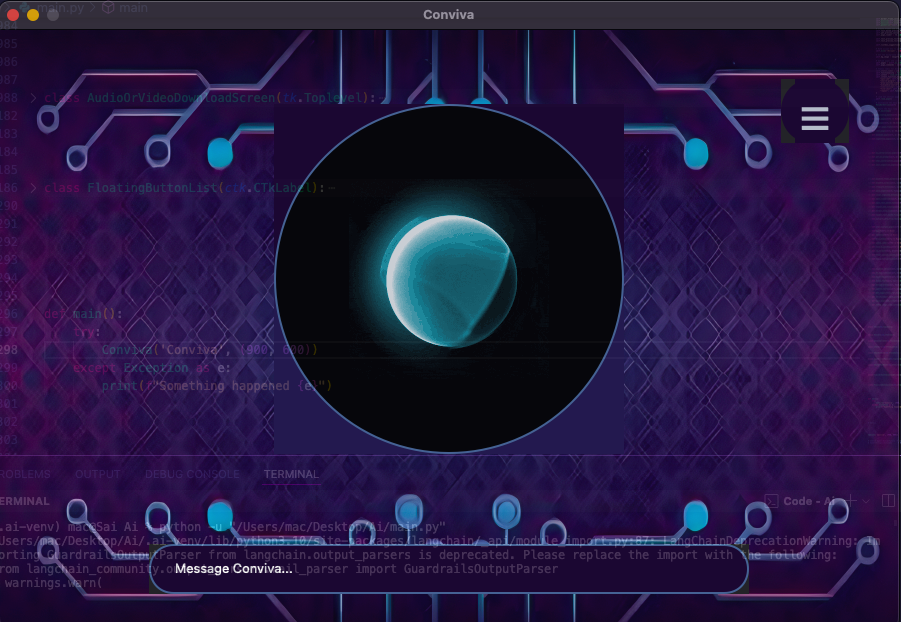
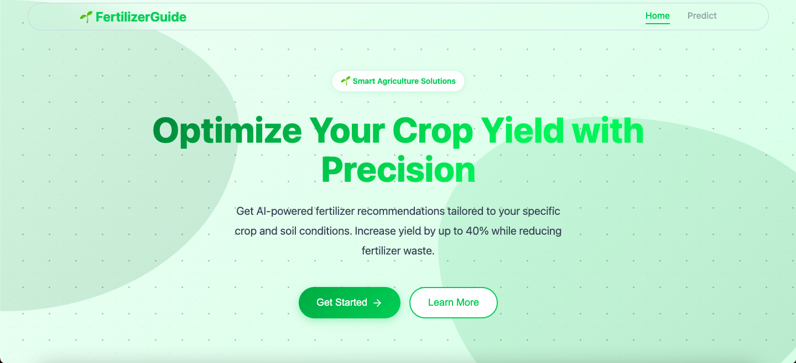
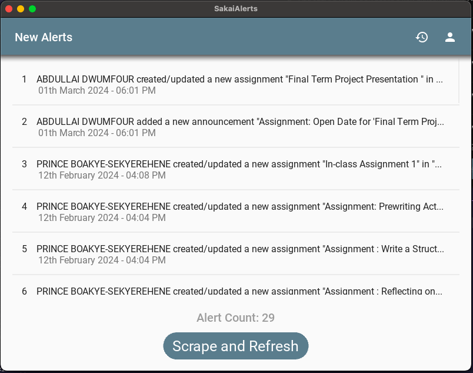

<picture>
  <source srcset="https://raw.githubusercontent.com/Programming-Sai/Programming-Sai/output/github-snake-dark.svg" media="(prefers-color-scheme: dark)" />
  <source srcset="https://raw.githubusercontent.com/Programming-Sai/Programming-Sai/output/github-snake.svg" media="(prefers-color-scheme: light)" />
  
</picture>

     

<h3 align='center'>Programming-Sai</h3>

Tech-driven, always learning, and focused on building efficient solutions.

  
  
  
  

"I am a dedicated Computer Science student with a strong foundation in web and mobile development. My expertise includes working with modern frameworks like React Native, Next.js, and backend technologies such as Node.js and Python. I have hands-on experience building responsive and functional applications, integrating APIs, and implementing authentication systems with OAuth.

I thrive on solving complex problems and would like to contributie to open-source projects. I'm eager to collaborate on innovative and impactful projects that challenge me to grow as a developer."

---

## 🤝 Connect with Me

---

## 📊 GitHub Stats

|                                                                                                                                          |                                                                                                                                                    |
| ---------------------------------------------------------------------------------------------------------------------------------------- | -------------------------------------------------------------------------------------------------------------------------------------------------- |
|  |  |

---

### Languages and Tools:

<picture>
  <source srcset="github-dark.svg" media="(prefers-color-scheme: dark)" />
  <source srcset="github-light.svg" media="(prefers-color-scheme: light)" />
  
</picture>
<picture>
  <source srcset="terminal-dark.svg" media="(prefers-color-scheme: dark)" />
  <source srcset="terminal-light.svg" media="(prefers-color-scheme: light)" />
  
</picture>
 
 

---

### Projects Preview

|                                                                                                                                                                                                                                                                                                          |                                                                                                                                                                                                                                                                                                                                         |
| -------------------------------------------------------------------------------------------------------------------------------------------------------------------------------------------------------------------------------------------------------------------------------------------------------- | --------------------------------------------------------------------------------------------------------------------------------------------------------------------------------------------------------------------------------------------------------------------------------------------------------------------------------------- |
|                                                                                                                                                        |                                                                                                                                                                                |
| <a href="https://programming-sai.github.io/Blog/" target="_blank"><picture><source srcset="blog-dark.png" media="(prefers-color-scheme: dark)" /><source srcset="blog-light.png" media="(prefers-color-scheme: light)" /></picture></a> |                                                                                                                                                                                                                                             |
| <a href="https://github.com/Programming-Sai/File-Explorer         " target="_blank">                                                                                          | <a href="https://github.com/Programming-Sai/SakaiAlerts" target="_blank"><picture><source srcset="sakai-alerts-dark.png" media="(prefers-color-scheme: dark)" /><source srcset="sakai-alerts-light.png" media="(prefers-color-scheme: light)" /></picture></a> |

---

⭐️ If you like what you see, don't forget to [follow me](https://github.com/Programming-Sai) and star ⭐ my repositories!
